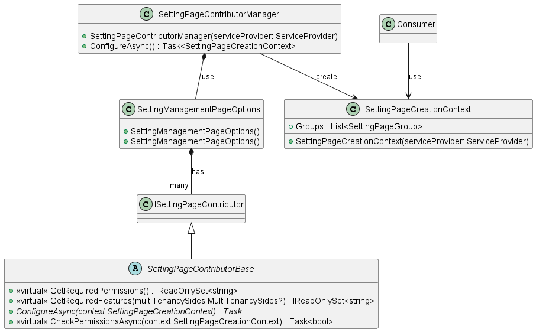

# Introduction

Contributers pattern have beed used in multiple modules and packages of Abp framework (Toolbar Contributor, Tenant Resolver, Settings Page Contributer, Image Resizer Contributor)

Contibutor pattern allow external modules to contributes on execute/render components in existing modules, the most common example is `IMenuContributor` [Navigation-Menu](https://docs.abp.io/en/abp/latest/UI/AspNetCore/Navigation-Menu).

The `AbpUiNavigationModule` allow external modules to contributes and add their navigation menus. this makes the UI Navigation centralized on the applicaton, open for extension and closed for modificatin   

```cs
using System.Threading.Tasks;
using MyProject.Localization;
using Volo.Abp.UI.Navigation;

namespace MyProject.Web.Menus
{
    public class MyProjectMenuContributor : IMenuContributor
    {
        public async Task ConfigureMenuAsync(MenuConfigurationContext context)
        {
            if (context.Menu.Name == StandardMenus.Main)
            {
                await ConfigureMainMenuAsync(context);
            }
        }

        private async Task ConfigureMainMenuAsync(MenuConfigurationContext context)
        {
            var l = context.GetLocalizer<MyProjectResource>();

            context.Menu.AddItem(
                new ApplicationMenuItem("MyProject.Crm", l["Menu:CRM"])
                    .AddItem(new ApplicationMenuItem(
                        name: "MyProject.Crm.Customers", 
                        displayName: l["Menu:Customers"], 
                        url: "/crm/customers")
                    ).AddItem(new ApplicationMenuItem(
                        name: "MyProject.Crm.Orders", 
                        displayName: l["Menu:Orders"],
                        url: "/crm/orders")
                     )
            );
        }
    }
}
```
# Deep dive in Abp.io Contributer pattern:

## Definition
The contributor pattern is used to allow various parts of an application to contribute or inject additional functionality into a core component without directly modifying it. in simple words it's an implementation for OC princeple.

    Software entities (classes, modules, functions, etc.) should be open for extension, but closed for modification.


## Analysis

let's start by analysing two of the most common usage of `Contributer Pattern`

#### 1) Menu conitrubutor:


As shown in the diagram, menu *contributors* that implement `IMenuContributo` can manage and configgure thier menu items by accessing `MenuConfigurationContext`, `MenuConfigurationContext` shared between all contributors and represents the *data model*.

the implementation of `IMenuManager` (*manager*) creates `MenuConfigurationContext`, load all contibutors and execute `ConfigureMenuAsync`.


#### 2) Settings Page Contributor:



I think it's now more clear and you can start capture the pattern, in settings page again we have the `SettingPageCreationContext` which shared between all contributors and contains the settings groups (*data model*).

the `SettingPageContributorManager` creates the `SettingPageCreationContext`, loads the contributors by the help of DI `SettingManagementPageOptions`, and execute the `contributor.ConfigureAsync(context);`

A slight different between both MenuContributor strucutre and SettingsPageContributor structor, that `SettingPageCreationContext` exposed to consumers while in Menu management you can access the data model only by using `IMenuManager`

## Structure of Contributor Pattern:


* *ComponentContext*: a shared context with all contributors contains initial values and data models related to contributor component.

* *Contributor*: Implements `Configure` method that acccess `ComponentContext` to add it's contribution to a component.

* *ContributorManager*: Create and initialize `ComponentContext`, load and configure `Contributor`s

* *ContributorOptions*: a useage of `IOptions<>` pattern to use DI to load contributors, used by `ContributorManager`


* the `Component` will use the `ComponentContext` when it executed/rendered/created.

* the `ComponentContext` will contains the contributions of all contributors (`InputData` as an example).

* all contributors (`IComponentContributor`) can contribute on conifigure/create `InputData` by accessing `ComponentContext`. 

* `ComponentContributorManager` responsibe for loading contributors and run their configure functions.

# Example:

